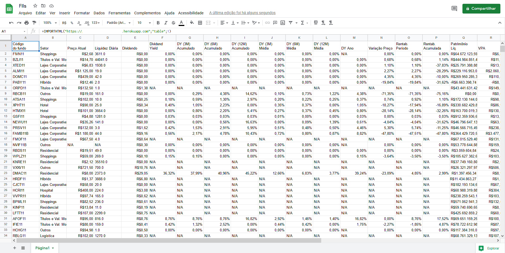

# Get content into new page

Este é um projeto simples feito em node com express para pegar o conteúdo de uma URL e jogar em outro site.
Inicialmente desenvolvido para burlar bloqueios de IPs para importação de planilhas de sites de investimentos.

#### Exemplo

